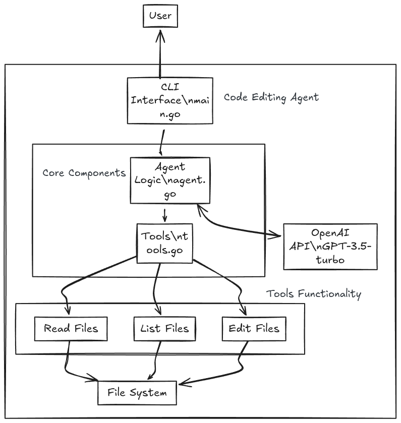

# Code Editing Agent

A conversational CLI agent powered by OpenAI, capable of reading, listing, and editing files in your workspace using natural language and function calling.

## Features

- **Read files:** View the contents of any file in your workspace.
- **List files:** Explore directories and see available files/folders.
- **Edit files:** Replace text or create new files programmatically.
- **OpenAI-powered:** Uses GPT-3.5-turbo with function calling for intelligent code and 
file operations.

## Architecture



## Project Structure

```
.
├── main.go                      # Entry point, CLI wiring
├── go.mod                       # Go module definition
├── internal/
│   ├── agent/
│   │   └── agent.go             # Agent logic (conversation, tool execution)
│   └── tools/
│       └── tools.go             # Tool definitions (read, list, edit files)
└── README.md                    # Project documentation
```

## Setup

1. **Clone the repository:**
   ```sh
   git clone <your-repo-url>
   cd code-editing-agent
   ```

2. **Install dependencies:**
   ```sh
   go mod tidy
   ```

3. **Set up your OpenAI API key:**
   - Create a `.env` file in the project root:
     ```
     OPENAI_API_KEY=your_openai_api_key_here
     ```

4. **Run the agent:**
   ```sh
   go run main.go
   ```

## Usage

- Type your requests in the terminal (e.g., "Show me the contents of main.go" or "Replace foo with bar in internal/tools/tools.go").
- Use `Ctrl+C` to exit.

## Extending

- Add new tools in `internal/tools/tools.go`.
- Register them in `main.go` by adding to the `toolsList`.


